  

  
  

<table align="center">
  <tr>
    <td bgcolor="#161b22">
      <b>Nandhagopal A</b> — I don't study code. I ship it. I understand things by doing them — if I can't explain why it works, I haven't learned it yet. That's why I build: an AI voice assistant, a multi-agent intelligence platform, a native desktop app in Rust. No tutorials. Just problems and code.
    </td>
  </tr>
</table>

<table>
  <tr>
    <td>📍 <b>Location</b></td>
    <td>Tamil Nadu, India</td>
    <td>🎓 <b>Education</b></td>
    <td>BCA, 4th Semester</td>
  </tr>
  <tr>
    <td>🐍 <b>Primary</b></td>
    <td>Python → Backend → AI/Automation</td>
    <td>🎯 <b>Goal</b></td>
    <td>Software Engineer → MCA</td>
  </tr>
  <tr>
    <td>⚡ <b>Strength</b></td>
    <td>Logic, Practical Thinking, Problem Solving</td>
    <td>🧠 <b>Style</b></td>
    <td>Understand first, build immediately</td>
  </tr>
</table>

 

**`What makes me different:`** I'm not the "memorize and pass" type. Theory without practice doesn't stick in my head. I need to *understand why* before I remember *how*. Every repo here exists because I had a problem and code was the answer.

---

### Tech Stack

---

### What I've Built

<table>
  <tr>
    <td width="50%" align="center">
      
        
        
       
      Real-time speech + vision + persistent memory. 100% free/open-source.
    </td>
    <td width="50%" align="center">
      
        
        
       
      Intelligence pipeline — scrape → verify → generate insights.
    </td>
  </tr>
  <tr>
    <td width="50%" align="center">
      
        
        
       
      Native Windows wallpaper manager. Multi-monitor + lock screen.
    </td>
    <td width="50%" align="center">
      
        
        
       
      Auto-downloads from Telegram channels → FDM. Set & forget.
    </td>
  </tr>
</table>

---

### The Real Stats

<table>
  <tr>
    <td align="center"><b>5</b> Repos Shipped</td>
    <td align="center"><b>4</b> Languages Used</td>
    <td align="center"><b>Python</b> Primary Weapon</td>
    <td align="center"><b>Rust</b> Learning Deep</td>
  </tr>
  <tr>
    <td align="center"><b>FastAPI</b> Backend Choice</td>
    <td align="center"><b>React</b> Frontend Choice</td>
    <td align="center"><b>Tauri v2</b> Desktop Framework</td>
    <td align="center"><b>AI + LLMs</b> Current Focus</td>
  </tr>
</table>

  

---

### Right Now — Building **AI automation tools** with Python + LLM APIs (Groq, Gemini), going deeper into **Rust** for systems programming, preparing for **MCA** while shipping real projects. Open to **freelance work** in Python automation & backend.

---

### Connect

  
  
  

---

### More About Me

- Logic-first thinker — understanding > memorization, always
- Strongest in: **tech, logic, practical work**. Weakest in: pure theory
- Curious but cautious — I evaluate ROI before jumping into anything
- Career priority: **stable IT job → salary growth → optional abroad → future food business**
- I learn best with **step-by-step progress** and **visible results**
- Currently doing Zomato delivery part-time while building my dev career
- I don't overthink anymore — I pick a direction and build

> *Stability first → Specialization → Income → Business later.*

---

  

